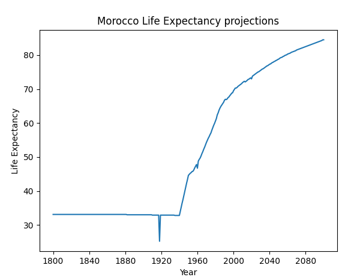
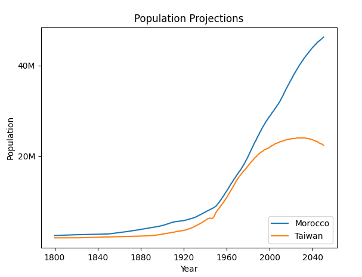

# DataTable
load, manipulate, and display tabular data.

## Ex00: Load my Dataset
load a csv dataset using pandas, print its shape, and return the dataframe.

```py
import pandas as pd

# Loading a csv file using pandas:
df: pd.DataFrame = pd.read_csv("filepath")

# get dataframe shape
print(df.shape)
```

## Ex01: draw my country
using the previous load function, load the life expectancy data, get your countries life expectancy, and display it on a line graph.

learn how to use pandas indexing, and use pyplot to show a graph with a proper title and proper labeling.
```py
# get row with label 'Morocco'
df = df.loc['Morocco']

# display the data frame:
plt.plot(df)

# set the graph title, x ticks, x label, y label
plt.title("Morocco Life Expectancy projections")

plt.xticks(range(0,len(df), 40))
plt.xlabel("Year")
plt.ylabel("Life Expectancy")
```
Result:  


## Ex02: Compare my Country
Load date on country population, and compare your country's data with some other country.

figure out how to plot multiple lines, manipulate data before plotting, and how to shows a legend and customize the graph.

```py
# slice the data
df = df[:'2050']

# map lambda over values to convert from number abbreviation format to float
f = lambda x: float(x[:-1])

df = df.map(f)

# add label to plot for legend
plt.plot(df, label="Morocco")

# render legend and position it in the lower right corner
plt.legend(loc=4)
```

